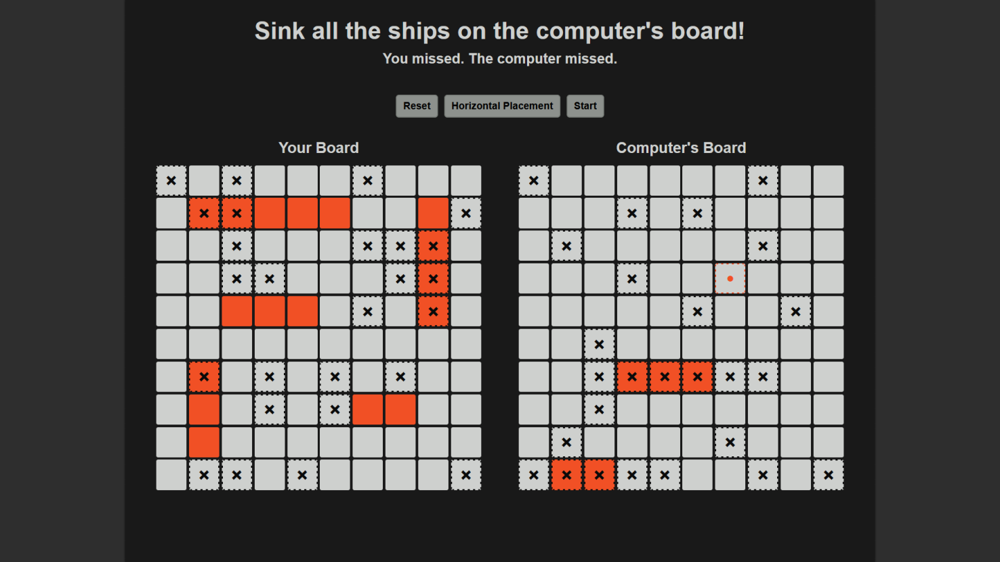

# Battleship

Implementation of the classic board game Battleship, built with JavaScript using Test-Driven Development (TDD) principles as part of The Odin Project.

## Technologies Used

-   JavaScript (ES6+)
-   HTML5
-   CSS3
-   Jest (Testing Framework)
-   Babel (for ES6 compatibility with Jest)

## Live Demo

You can check out the live demo of the project here: [Live Demo](https://emre-oktay.github.io/battleship/)

## Screenshot

